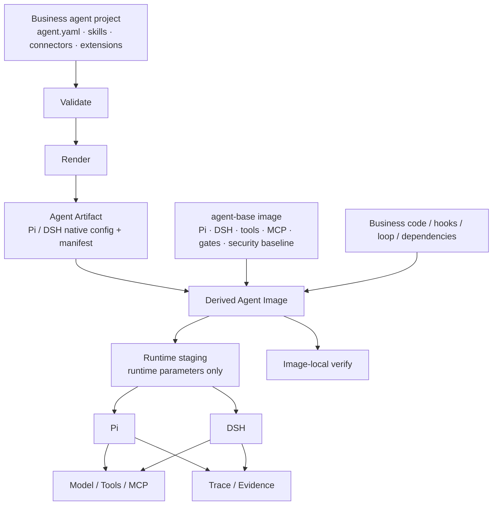

# agent-base

**`agent-base` is a base container image for building and shipping business AI agents.**

[中文](README.zh-CN.md)

The base image comes with pinned agent runtimes (Pi and DSH), common tooling, preinstalled MCP server packages, startup logic, verification tools, and a hardened container baseline. It intentionally contains **no business agent**.

A real agent is built on top of it:

```dockerfile
FROM ghcr.io/uukuguy/agent-base:0.1.0

# Add the rendered agent artifact
# Add business code / hooks / loop extensions
# Add business-specific dependencies
```

The result is your own deployable agent image.

```text
agent-base image
├── Pi / DSH (pinned)
├── common tools and preinstalled MCP servers
├── startup and runtime isolation
├── four-stage verification
└── non-root / offline / image-consistency checks
          │
          │ FROM
          ▼
      my-agent image
      ├── Agent Artifact
      ├── skills / connectors
      ├── business code
      ├── hooks / loop extensions
      └── business dependencies
```

The repository is more than the Dockerfile. It also contains the agent project template, shared definition contract, Pi and DSH adapters, renderers, verification tooling, traces, conformance checks, and the derived-image build path.

During development, you work on a normal agent project. For delivery, that project becomes a derived image based on `agent-base`. Local development, CI, testing, and deployment use the same agent artifact and the same runtime rules.

`agent-base` is not another agent framework. Pi or DSH still owns the actual agent loop.

---

## Why not just use Pi or DSH and write a Dockerfile?

If all you need is a prompt, a few skills, some MCP connections, and a local agent that runs, you probably **do not need agent-base**. Configuring Pi or DSH directly is simpler.

The project starts to matter when an agent becomes software that must be maintained, upgraded, tested, and shipped repeatedly. That is where teams tend to rebuild the same infrastructure—and still have trouble proving what they actually tested.

### 1. Verify runtime behavior, not just generated files

A valid YAML or JSON file only proves that a file was produced. It does not prove that the runtime used it.

`agent-base` starts the real harness and checks whether:

- declared skills were actually loaded;
- connectors actually registered and can start;
- tool restrictions really take effect;
- hooks really execute and leave evidence;
- a complete request can run under those constraints.

`make verify` runs four checks in order:

| Stage        | Question                                                     |
| ------------ | ------------------------------------------------------------ |
| **Validate** | Is the agent definition valid and complete?                  |
| **Doctor**   | Can the real harness resolve and load the rendered configuration? |
| **Probe**    | Can the runtime, tools, and integrations actually start and connect? |
| **Smoke**    | Can a complete request finish and produce a report and trace? |

The default path uses a local test gateway, so model checks run **without real model credentials**. External connectors still need a reachable service or a test substitute.

If a capability cannot be proved, it is reported as `unverified` instead of being treated as working because nothing visibly failed.

### 2. Put delivery invariants in the base layer

An agent that works on a laptop can easily become a different system in CI or inside a container.

`agent-base` turns several easy-to-forget rules into enforceable defaults:

- behavior-changing content is versioned in the artifact; endpoints, credentials, workspaces, and other deployment values are supplied at runtime;
- delivered artifacts stay read-only; runtime changes happen in staging rather than by rewriting the artifact;
- missing configuration, unsupported capabilities, and unknown declarations fail explicitly instead of silently degrading;
- the base image runs as a non-root user by default;
- container acceptance checks exercise offline dependencies, permission boundaries, and filesystem constraints;
- image input fingerprints make stale-image drift detectable.

These are executable conditions, not documentation that every project has to remember to follow.

### 3. Use one business definition across runtimes without hiding the differences

Pi and DSH do not work the same way. Their skill loading, tool restrictions, MCP support, hooks, and extension mechanisms are different.

`agent-base` does not pretend otherwise. The business-level definition is shared where that is useful; adapters render it into native Pi and DSH forms.

Capabilities that claim portability must pass on each runtime. Differences that cannot be made equivalent must be declared explicitly rather than silently ignored.

That makes the second runtime useful for more than feature count: it turns portability into something you can test.

### 4. Let the final business image verify itself

The base image carries the verification gates with it. After a derived image adds its artifact, business code, hooks, or other extensions, the final image can still run those checks internally.

`make image-derived` builds the derived image and performs this in-image verification. The verification path can run without real model credentials.

A business project's CI can use this command to check the **image it is going to ship**. This repository's production acceptance workflow checks the shared base image.

---

## Develop as a project, ship as an image

Business development does not happen inside the `agent-base` repository. Each agent is its own project:

```text
workspace/
├── agent-base/
└── my-agent/
    ├── agent.yaml
    ├── connectors.yaml
    ├── skills/
    ├── harness/          # optional Pi / DSH-specific extensions
    └── Makefile
```

A minimal `agent.yaml` can stay small:

```yaml
apiVersion: agent-base/v1
name: my-agent
description: A focused business assistant

persona:
  instructions: |
    You are an evidence-oriented business assistant.
    State uncertainty instead of inventing facts.

model:
  provider: deepseek
  name: deepseek-flash

# Optional
# tools:
#   deny: [bash]
```

The project stores the things that define agent behavior: instructions, skills, connector declarations, tool boundaries, and runtime-specific extensions.

API keys, endpoints, workspace locations, and environment-specific model selections belong at runtime instead of being baked into the business definition.

The path from source project to delivery looks roughly like this:

```text
my-agent/
   │
   ├─ validate
   │
   ├─ render
   ▼
Agent Artifact
   │
   ├─ Pi native configuration
   ├─ DSH native configuration
   ├─ manifest
   └─ verification metadata
   │
   │ + agent-base image
   ▼
my-agent image
   │
   ├─ run
   └─ verify
```

---

## Quick start

### Requirements

- Node.js 24+
- GNU Make
- Docker
- Docker Desktop or OrbStack on macOS

### 1. Prepare the base development environment

```bash
git clone https://github.com/uukuguy/agent-base.git
cd agent-base

npm ci
make dev-env
make local-packages
make local-packages-check
```

`make dev-env` prepares the pinned Pi and DSH versions. The local package steps keep development dependencies aligned with what the base image expects.

### 2. Create a business agent

```bash
make new-agent NAME=my-agent DESCRIPTION="My business assistant"
cd ../my-agent
```

Edit the project as needed:

```text
agent.yaml
connectors.yaml
skills/
```

Then verify it locally:

```bash
make validate
make verify
```

The default verification path does not require a real model key, and it does not judge the quality of business answers. It checks definition, loading, execution, and engineering boundaries.

### 3. Run against a real model

Declare the provider and model in the project, then supply the endpoint and credentials at runtime:

```bash
make run-local \
  ENDPOINT=https://your-gateway.example/v1 \
  API_KEY='<secret>' \
  PROMPT='Assess the main risks in this change.'
```

Do not commit real credentials to the agent project or Git.

OpenAI-compatible services such as Ollama, vLLM, and LM Studio can also be used as local or private endpoints. See [Quickstart](docs/01-quickstart.md) for provider and model configuration.

### 4. Build the delivery image

Back in the `agent-base` repository:

```bash
make image
make image-derived AGENT_DIR=../my-agent
```

`make image` builds the base image. `make image-derived` adds the rendered agent artifact and optional overlay to that base, then verifies the final image from inside the container.

The default base tag matches the host architecture. To use a registry image, pass `BASE_IMAGE=registry.example.com/team/agent-base:0.1.0`; Docker selects the matching architecture when that tag is a multi-architecture image.

---

## How Pi and DSH fit in

Pi and DSH are the runtimes that execute the agent loop. They are not model providers.

Pi is currently the default runtime, with DSH maintained as a second supported runtime:

|                        | Pi                                  | DSH                                  |
| ---------------------- | ----------------------------------- | ------------------------------------ |
| Role                   | default runtime                     | second supported runtime             |
| Business definition    | `agent.yaml` / skills / connectors  | the same business definition         |
| Adapter                | `adapters/pi/`                      | `adapters/dsh/`                      |
| Native extension model | Pi extensions / CLI / configuration | Cordis / profile / plugin mechanisms |

You can verify the same project on either side:

```bash
make verify HARNESS=pi
make verify HARNESS=dsh
```

The implementations do not have to look alike. Shared claims do have to be verifiable on each runtime. Real differences stay visible in adapters and exemptions instead of being hidden behind a lowest-common-denominator API.

See [Runtime selection facts](docs/design/2026-09-27-runtime-selection-facts.md) for the current capability differences.

---

## Engineering verification is not business evaluation

A `usable` result has a narrow meaning: **the agent passed agent-base's engineering checks under the tested conditions.**

It does not mean a contract review is correct, a grid-risk assessment is good, or a privacy detector is accurate.

Those questions belong to business evals with domain datasets, metrics, and acceptance criteria.

Engineering verification answers “did the system behave as declared?” Business evaluation answers “was the result good?” They are separate layers.

---

## Put behavior in the artifact; keep environment values at runtime

The project uses one simple boundary:

> Version the things that define agent behavior. Supply deployment-specific values at runtime.

Typical artifact contents include instructions, skills, connector declarations, tool boundaries, harness-specific extensions, and the capability bundles the artifact allows.

Typical runtime values include API keys and tokens, model endpoints, environment-specific model names, workspace paths, permission mode, and the active subset of already-allowed capability bundles.

This keeps a deployable agent from being silently redefined by a large collection of untracked environment variables as it moves through development, CI, test, and production.

---

## Skills, connectors, capabilities, and deeper customization

**Skills** belong to the business agent and carry task knowledge, operating procedures, and supporting scripts.

**Connectors** reach external systems, primarily through MCP. The project declares what it needs; each adapter converts that declaration into native runtime configuration.

**Capability bundles** group named capabilities. The artifact records which bundles are allowed, and runtime activation can only select from that set. Unknown or undeclared bundle names fail explicitly.

**Harness extensions / overlays** carry Pi- or DSH-specific extensions, business code, and hooks. Deeper customization can continue in the derived image with custom loops, service layers, and additional dependencies.

The shared contract is not intended to restrict every agent to the intersection of Pi and DSH. The base only guarantees what it can verify. Explicit extensions are allowed; capabilities that cannot yet be proved remain marked `unverified`; business policy and service implementation stay owned by the business layer.

See [Developer contract](docs/13-developer-contract.md) for the exact boundary.

---

## Container model

The layers are intentionally separate:

| Layer                   | Contains                                                     |
| ----------------------- | ------------------------------------------------------------ |
| **agent-base image**    | Pi / DSH, toolchain, preinstalled MCP servers, startup, verification gates, security baseline |
| **Agent Artifact**      | rendered runtime-native configuration, manifest, and verification metadata |
| **Derived Agent Image** | `FROM agent-base` + Agent Artifact + business code / hooks / dependencies |

The base image runs as a non-root user by default and supports both `linux/amd64` and `linux/arm64`. Production and debug images are separate variants.

Delivered artifacts stay read-only. If the runtime needs temporary configuration, startup creates a staging copy rather than mutating the artifact.

Because the verification gates are also present in the image, a derived image can prove that its added business layer did not break the base contract.

See [Deployment](docs/06-deploy.md) for details.

---

## Architecture



The repository follows the same boundaries:

| Directory       | Purpose                                                      |
| --------------- | ------------------------------------------------------------ |
| `core/`         | shared definitions, catalogs, gates, traces, runtime rules, and image logic |
| `adapters/pi/`  | Pi rendering, startup, Doctor, tracing, and runtime-specific integration |
| `adapters/dsh/` | DSH rendering, startup, Doctor, tracing, and runtime-specific integration |
| `conformance/`  | blocking runtime and container conformance checks            |
| `template/`     | business-agent template used by `make new-agent`             |
| `examples/`     | runnable reference projects                                  |
| `tools/`        | implementations behind the Make command surface              |
| `docs/`         | usage, architecture decisions, and verification contracts    |

Shared logic belongs in `core/`, runtime-specific logic in `adapters/<harness>/`, and business code in the business project and derived image.

---

## Examples

The repository includes several complete projects:

| Use case                                          | Example                                                      |
| ------------------------------------------------- | ------------------------------------------------------------ |
| Contract review with external systems             | [`examples/contract-review`](examples/contract-review)       |
| Change-risk assessment with custom business tools | [`examples/change-risk-review`](examples/change-risk-review) |
| Sensitive-data detection and redaction checks     | [`examples/privacy-redaction`](examples/privacy-redaction)   |
| Local models such as Ollama / vLLM                | [`examples/local-model-dev`](examples/local-model-dev)       |
| The same agent across multiple environments       | [`examples/multi-env-rollout`](examples/multi-env-rollout)   |

These examples demonstrate engineering structure and integration patterns. They do not imply that the business task itself has been evaluated for your data or acceptance criteria.

---

## What agent-base does not do

`agent-base` is not a model gateway, visual agent builder, business workflow platform, or multi-tenant SaaS control plane. It also does not own business evals, authentication, billing, high availability, or user lifecycle management.

Those layers can be built in a derived image or in a platform above it.

If your program is a small script that makes one model API call, a provider SDK is usually the better tool. `agent-base` is for agents that need to be developed, verified, upgraded, and shipped as maintained software.

---

## Documentation

- [Quickstart](docs/01-quickstart.md) — create, verify, and run an agent
- [Concepts](docs/02-concepts.md) — shared definition and Pi / DSH mappings
- [Capability catalog](docs/03-capability-catalog.md) — current capability surface
- [Deployment](docs/06-deploy.md) — base image, runtime parameters, and derived images
- [Developer contract](docs/13-developer-contract.md) — what the base guarantees and what it does not
- [How to verify](docs/14-how-to-verify.md) — verification flow, reports, and limits
- [CI production acceptance](docs/15-ci-production-acceptance.md) — repository-level Linux acceptance
- [Current state](docs/status/CURRENT-STATE.md) — current implementation and known gaps

`docs/design/` contains architecture decisions and runtime experiments. Generated catalogs and fact sheets should be regenerated from their sources rather than edited by hand.

---

## Status

`agent-base` is under active development. The current implementation includes the base image, Pi and DSH adapters, four-stage verification, unified traces, capability bundles, container conformance, derived images, and in-image self-verification.

Capabilities that are not yet part of the stable contract—or that do not yet have a reliable executable check—remain explicitly marked incomplete or unverified rather than being advertised as supported.
