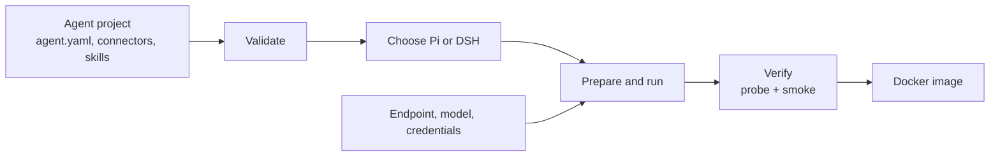

# agent-base

**Turn a folder of agent instructions and tools into a tested Docker image.**

[中文说明](README.zh-CN.md)

## What is agent-base?

`agent-base` is the build and test kit for an AI agent project.

You put an agent's instructions, model settings, tools, connectors, and skills in a folder. This repository gives you commands to:

1. check that the definition is valid;
2. prepare the files needed by the program that runs it;
3. run it against the built-in test gateway or a real model endpoint;
4. test that the declared tools and permissions actually work;
5. package the same definition as a Docker image (OCI format) for CI or deployment.

The goal is simple: the agent you test on your laptop is the same agent you test and ship in a container.

`agent-base` is **not** a model, a hosted chatbot, an API gateway, or a multi-tenant application. It is the build, run, and verification layer for those applications.

## Who should use it?

Use it when you need to:

- build several agents from a consistent project layout;
- keep the agent's files separate from the program that executes them;
- run the same agent locally and in a restricted container;
- catch missing tools, wrong permissions, broken connectors, and leaked credentials before release;
- compare the two supported execution programs when you need to check compatibility.

If you only need to call a model from a short script, this repository is probably more than you need.

## The workflow

```text
agent.yaml + connectors + skills
              │
              ▼
       make validate        Is the definition complete and consistent?
              │
              ▼
       make verify          Does the rendered agent really start and work?
              │
              ▼
       make run-local       Try it with a fake gateway or your endpoint
              │
              ▼
       Docker image + CI    Rebuild and verify the same artifact before release
```

The checks are deliberately separate. A process starting is not enough: they also inspect what was loaded, which tools are available, whether the execution program can reach the expected gateway, and whether the final request produces a usable report and trace.

## Quick start

Requirements: Node.js 24+, GNU Make, and Docker. OrbStack works on macOS. Full production acceptance runs on a Linux CI runner with Docker, QEMU, and loopback networking.

From this repository:

```bash
npm ci
make dev-env
make local-packages
make local-packages-check

# Check the base repository itself
make validate
make validate-selftest

# Fast local regression. It marks selected container checks as skipped.
npm test
```

Create an agent project outside the base repository:

```bash
make new-agent NAME=release-review DESCRIPTION="Review release risk"
cd ../release-review

make validate
make verify HARNESS=pi
make run-local PROMPT="Review this release for operational risk"
```

For a real model endpoint, pass deployment values at invocation time. Do not put secrets in `agent.yaml`, generated files, or Git:

```bash
make run-local \
  ENDPOINT=https://your-gateway.example/v1 \
  API_KEY='<secret>' \
  PROMPT='Review this release for operational risk'
```

## What gets checked?

`make verify` runs four checks:

1. **Validate** — the agent files, references, tools, and settings are valid.
2. **Doctor** — the execution program reports what the prepared agent actually contains.
3. **Probe** — the execution program starts and reaches the built-in test gateway without a provider key.
4. **Smoke** — one end-to-end request produces a report and trace.

For release acceptance, build both image architectures and run the complete regression:

```bash
node core/image/build.mjs --all --debug
node core/image/build.mjs --manifest
node tools/regression.mjs --json
```

A complete acceptance run must exit with `0`, `failed: []`, and `skipped: []`. `npm test` is intentionally faster and does not replace this command.

## The two programs that can run an agent

The files in an agent project are not a model or a command-line program by themselves. They are read by an execution program, which loads the instructions and tools and then talks to the model. `agent-base` currently supports two such programs:

Most users should start with **Pi**. Choose **DSH** when you specifically need its DeepSeek command-line or MCP behavior. You do not need to understand either program before using the basic `make validate`, `make verify`, and `make run-local` workflow.

| Program | Package | Use it when |
|---|---|---|
| **Pi** | `@earendil-works/pi-coding-agent@0.87.1` | You want the default path |
| **DSH** | `@deepseek-ai/dsh@0.1.7-rc.1` | You need the DeepSeek CLI/MCP path |

Both programs are checked against the same C1–C10 behavior checklist. Their integration code stays under `adapters/`; the shared checking and image code stays under `core/`.

## How the pieces fit



The agent project contains the instructions and tool choices. Pi or DSH reads those files and talks to the model. The checks test the result. The image packages the result without copying host credentials into it.

## Repository map

- `core/` — shared schemas, checks, traces, image startup, and security checks.
- `adapters/` — the Pi and DSH integrations.
- `template/` — the starting layout for a new agent project.
- `examples/` — complete agent definitions you can inspect and run.
- `tools/` — command-line entry points such as `validate`, `verify`, `run-local`, and `regression`.
- `docs/` — design decisions, verification details, and the production CI contract.

Read [`AGENTS.md`](AGENTS.md) before changing the repository. Start with [`docs/14-how-to-verify.md`](docs/14-how-to-verify.md) when you need the full verification contract.

## Security and deployment notes

- Build steps may download pinned dependencies; execution checks support offline operation.
- Endpoint, model, and credentials are passed when the agent runs and are not baked into the image.
- Child processes receive an explicit environment allowlist.
- Images run as an unprivileged user. Container verification uses a read-only root, dropped capabilities, and an explicit temporary filesystem.
- The fake gateway lets CI exercise the full flow without a provider key.
- If a credential has ever been committed, remove it from Git history **and** revoke or rotate it in the provider account.

## Production acceptance

`.github/workflows/production-acceptance.yml` runs the checks that require a real Linux runner: Docker, loopback networking, QEMU, both image architectures, the OCI manifest, and the complete regression. It uploads the structured regression report as a workflow artifact.

The local OrbStack checks are useful during development. The GitHub workflow is the release check because it runs in the environment required by production.

## License

See [`LICENSE`](LICENSE).
