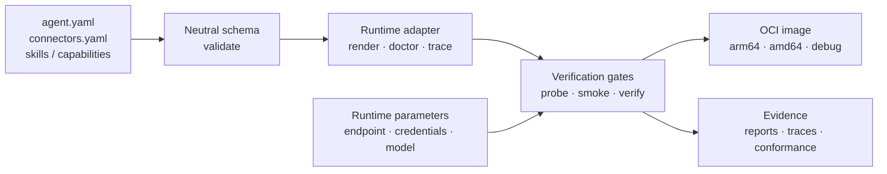

# agent-base

**Define, verify, and package portable AI agents.**

agent-base separates an agent's portable definition from the runtime that executes it. You describe the agent once, render it through a version-pinned runtime adapter, verify the result through four gates, and package the same evidence-backed artifact as a hardened OCI image.

[中文说明](README.zh-CN.md)

## Why agent-base exists

AI agent projects often fail at the boundaries: configuration drifts between local and container runs, credentials leak into artifacts, runtime-specific features become hidden dependencies, and a process that starts is mistaken for an agent that is usable.

agent-base makes those boundaries explicit:

- **Portable definitions** keep business intent independent from a runtime.
- **Adapters** translate the definition into a pinned harness and expose its real capabilities.
- **Verification gates** turn claims such as “this skill is loaded” or “this image works offline” into executable evidence.
- **Versioned builds** fix behavior and declared package versions at build time while injecting deployment parameters at runtime.
- **Structured traces and reports** make failures attributable instead of silent.

## Architecture



The core remains runtime-neutral. Runtime-specific behavior belongs under `adapters/<runtime>/`; the current adapters are:

| Runtime | Pinned package | Role |
|---|---|---|
| **Pi** | `@earendil-works/pi-coding-agent@0.87.1` | Primary path with headless discovery and verification support |
| **DSH** | `@deepseek-ai/dsh@0.1.7-rc.1` | Comparison path with native permissions and MCP behavior |

The two adapters pass the same blocking conformance suite, C1–C10.

## What you can use it for

- Build internal agents from a small, reviewable neutral specification.
- Run the same definition locally and inside a constrained container.
- Package skills, connectors, capability implementations, and pinned dependencies into an OCI artifact.
- Verify zero-credential behavior with the built-in fake gateway.
- Compare runtime behavior without hiding incompatibilities behind documentation.
- Give an automated reviewer machine-readable plans, reports, traces, and failure reasons.

Business applications are generated or maintained outside this repository and use its documented command surface. Authentication, multi-tenancy, service orchestration, and provider account management belong to the application or deployment platform.

## Quick start

Requirements: Node.js 24+, GNU Make, and Docker. OrbStack works on macOS; production acceptance runs on a Linux CI runner with Docker, QEMU, and loopback networking.

```bash
# Install the toolchain dependencies
npm ci

# Install the pinned runtimes globally and connectors locally
make dev-env
make local-packages
make local-packages-check

# Validate the repository contracts
make validate
make validate-selftest

# Fast local regression (container-heavy checks are reported as skipped)
npm test
```

Create and verify an agent:

```bash
make new-agent NAME=my-agent DESCRIPTION="An agent that reviews release risk"
cd ../my-agent

make validate
make render HARNESS=pi
make verify HARNESS=pi
```

For a real endpoint, pass deployment parameters at invocation time. Keep credentials out of `agent.yaml`, generated artifacts, and Git history:

```bash
# Run against a checked-out agent context.
make run-local \
  ENDPOINT=https://your-gateway.example/v1 \
  API_KEY='<secret>' \
  PROMPT='Review this release for operational risk'
```

## Verification model

“The process started” is not the acceptance criterion. The four gates are:

1. **Validate** — schemas, references, capability declarations, parameter layers, and naming.
2. **Doctor** — the rendered artifact reports what it actually contains.
3. **Probe** — the runtime starts, loads the declared surface, and reaches the zero-credential gateway.
4. **Smoke** — an end-to-end request produces a usable report and trace.

Run the complete local acceptance after building images:

```bash
node core/image/build.mjs --all --debug
node core/image/build.mjs --manifest
node tools/regression.mjs --json
```

A complete acceptance run must return exit code `0`, `failed: []`, and `skipped: []`. Pi and DSH each run the C1–C10 admission suite. `npm test` uses `--fast`, which skips selected container checks but still runs conformance; it requires Docker and does not replace full acceptance.

## Image and runtime boundaries

- Build-time dependencies may use the network; runtime verification runs with the network disabled.
- Runtime parameters such as endpoint, model, and credentials are injected explicitly and are excluded from the immutable artifact.
- Child processes receive an allowlisted environment instead of the host environment wholesale.
- Images use an unprivileged user. Controlled container verification applies dropped capabilities, a read-only root, and an explicit temporary filesystem; deployment must apply the same restrictions.
- Debug images are separate artifacts and production mode rejects debug execution.

The multi-architecture output is written to `dist/image/agent-base-0.1.0.oci.tar`. The production CI workflow also uploads structured regression evidence.

## Repository map

```text
core/                 runtime-neutral schemas, gates, traces, image logic
adapters/pi/          Pi renderer, doctor, runner, trace mapping, selftests
adapters/dsh/         DSH renderer, doctor, runner, trace mapping, selftests
conformance/          blocking C1–C10 runtime admission suite
template/             starter agent definition and Makefile
examples/             end-to-end business examples
tools/                command surface, fake gateway, verification, generators
docs/                 design, contracts, operations, troubleshooting, status
.github/workflows/    production Docker/QEMU acceptance
```

## Security and credential hygiene

Never commit `.env`, API keys, tokens, login state, or connector credentials. `make hygiene-selftest` checks credential hygiene, including obvious credential values in reachable Git history; this is a limited check, not a comprehensive secret scanner. A repository rewrite does not revoke a provider credential: if a real key was ever exposed, revoke and rotate it at the provider before reuse.


## CI and release acceptance

`.github/workflows/production-acceptance.yml` runs on a Linux runner and:

1. installs pinned local packages;
2. checks Docker and loopback prerequisites;
3. builds production and debug variants for both architectures;
4. produces the OCI manifest;
5. runs `node tools/regression.mjs --json`; and
6. uploads `regression.json` as an artifact.

Trigger it with `workflow_dispatch` or through a push/pull request when a Git remote is configured. See the [production acceptance guide](docs/15-ci-production-acceptance.md) for setup and required evidence.

## Documentation

- [Verification guide](docs/14-how-to-verify.md)
- [Production acceptance](docs/15-ci-production-acceptance.md)
- [Design and code review](docs/reviews/2026-09-30-agent-base-design-code-review.md)
- [Developer contract](docs/13-developer-contract.md)
- [Harness contract](docs/09-harness-contract.md)
- [Runtime selection facts](docs/design/2026-09-27-runtime-selection-facts.md)
- [Current status and handoff](docs/status/RESUME-NEXT-SESSION.md)
- [Repository agent instructions](AGENTS.md)

## License

No open-source license is currently declared in this repository.
