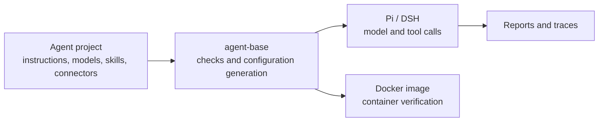

# agent-base

**Tools and base images for building, running, and testing AI agents.**

[中文](README.zh-CN.md)

With agent-base, you can build an agent for contract review, code review, or data redaction, give it instructions, models, tools, and skills, then try it locally and test it in Docker.

You write the agent's business logic. agent-base provides project templates, run commands, automated checks, traces, and a container environment. Each agent has its own project and uses the same development commands.

## What can you build?

The repository includes complete examples. Start with one close to your use case:

| Task | Example |
|---|---|
| Review contract clauses and connect to external systems | [Contract review](examples/contract-review/) |
| Assess change risk and add custom business tools | [Change risk review](examples/change-risk-review/) |
| Identify sensitive data and check redaction results | [Privacy redaction](examples/privacy-redaction/) |
| Use local model services such as Ollama or vLLM | [Local model development](examples/local-model-dev/) |
| Use the same agent configuration across environments | [Multiple environments](examples/multi-env-rollout/) |

These are reference projects. Adapt the instructions, skills, or code to your business and evaluate the results on your own tasks.

## Why use agent-base?

Building an agent involves more than writing a prompt. You also need to install tools, connect to models and services, manage permissions, record calls, and check that the agent still works in a container.

agent-base handles the repeated work:

- **Reuse the setup.** Templates, common tools, and connectors give each project the same starting point and commands.
- **Check that configuration took effect.** Automated checks inspect loaded skills, tools, and connectors and report missing components.
- **Reduce dependence on personal machine settings.** Separate configuration directories keep local credentials and extra skills from being picked up unintentionally.
- **Test the container before release.** Checks compare the image with its source and exercise offline operation, an unprivileged user, and permission limits.
- **Keep evidence for debugging.** Reports and call traces show where a run failed.
- **Compare agent software.** Run the same business definition with Pi or DSH; incompatibilities are reported explicitly.

These checks cover configuration and execution. Whether a contract analysis is correct or a risk assessment is useful still requires business-specific tests.

## Design

### Each agent is a separate project

An agent project typically contains:

```text
my-agent/
├── agent.yaml       # Instructions, model choice, and tool restrictions
├── connectors.yaml  # External service connections
├── skills/          # Task instructions and business scripts
└── Makefile         # Commands: validate, verify, run-local
```

Business development happens in your project. The base supplies shared tools, so adding an agent does not require copying the infrastructure.

### Define, run, and check

agent-base reads the project files, generates configuration for the chosen agent software, then starts and checks it. This lets the checks compare what the project declares with what the program actually loaded.

### Keep credentials out of the build

Instructions, skills, and tool configuration are versioned with the project. Model service addresses and credentials are supplied when it runs, keeping test credentials out of the image.

## Quick start

Requirements: Node.js 24+, GNU Make, and Docker. On macOS, you can use OrbStack.

### 1. Install development dependencies

```bash
git clone https://github.com/uukuguy/agent-base.git
cd agent-base
npm ci
make dev-env
make local-packages
make local-packages-check
```

`make dev-env` installs the pinned Pi and DSH versions. `make local-packages` installs the connector dependencies used by local checks.

### 2. Create and check an agent

```bash
make new-agent NAME=my-agent DESCRIPTION="My business assistant"
cd ../my-agent

make validate
make verify
```

The new project is created beside `agent-base`. Edit its instructions and model settings in `agent.yaml`, then add skills and connectors as needed.

`make validate` checks files and references. `make verify` uses a local test gateway to check startup and requests without a real model key. It does not assess the correctness of business answers.

### 3. Try a real model

First configure your provider and model in `agent.yaml`. For adding a provider or querying available models, see the [quickstart](docs/01-quickstart.md) and [model configuration](docs/02-concepts.md). Then run:

```bash
make run-local \
  ENDPOINT=https://your-gateway.example/v1 \
  API_KEY='<secret>' \
  PROMPT='Complete my test task'
```

`make run-local` needs a working model endpoint. Keep real credentials out of project files and Git.

## What are Pi and DSH?

They are two existing agent programs. They call the model, execute the tools it selects, and continue processing the results. They are distinct from **model providers** such as DeepSeek and OpenAI.

agent-base supplies common project files and checking commands on top of these programs. **Pi** is the default. To check the same project with **DSH**, change the command argument:

```bash
make verify HARNESS=pi
make verify HARNESS=dsh
```

`HARNESS` selects the agent program. Use the default for the basic workflow; changing a model or provider does not necessarily require switching Pi/DSH.

| Program | Pinned version |
|---|---|
| Pi | `@earendil-works/pi-coding-agent@0.87.1` |
| DSH | `@deepseek-ai/dsh@0.1.7-rc.1` |

Both use the same admission checks, but their extension mechanisms and some capabilities differ. See the [runtime comparison](docs/design/2026-09-27-runtime-selection-facts.md).

## Architecture



| Directory | Purpose |
|---|---|
| `core/` | Shared definition rules, checks, reports, traces, and image logic |
| `adapters/` | Translate project files for Pi and DSH and integrate their execution and traces |
| `template/` | Template for new agent projects |
| `examples/` | Complete business reference projects |
| `tools/` | Command entry points |
| `docs/` | Usage, design, and verification guides |

## Verification and containers

`make verify` runs four checks:

| Check | Question |
|---|---|
| Validate | Is the definition valid, and do its references exist? |
| Doctor | Does the generated configuration contain the expected components? |
| Probe | Does the program start, load its tools, and reach the test gateway? |
| Smoke | Does a test request complete and produce a report and trace? |

Container checks also exercise a read-only root filesystem, an unprivileged user, dropped Linux capabilities, and offline execution. Base images support `linux/amd64` and `linux/arm64`; debug images are built separately.

When maintaining the base, run the complete regression from its repository root:

```bash
node core/image/build.mjs --all --debug
node core/image/build.mjs --manifest
node tools/regression.mjs --json
```

A passing run exits with `0`, `failed: []`, and `skipped: []`. `npm test` is a faster development check; it still requires Docker and explicitly skips selected container checks.

The GitHub [acceptance workflow](.github/workflows/production-acceptance.yml) builds and checks images on Linux and saves a structured report. Building images downloads dependencies. Offline checks verify that container dependencies are available; real model calls still need access to a model service.

## Scope

agent-base is intended for teams that develop, test, and compare business agents over time. It provides verification conditions close to deployment and a foundation for building application images.

Authentication, multi-tenancy, human approval, high availability, and long-running service orchestration belong to the application or deployment platform. For a short script that calls a model, a provider SDK may be sufficient.

## Further reading

The detailed guides are currently in Chinese.

- [Quickstart](docs/01-quickstart.md): model configuration, local execution, and login options.
- [Capability catalog](docs/03-capability-catalog.md): available tools and capabilities.
- [Troubleshooting](docs/07-troubleshooting.md): diagnose configuration that did not take effect.
- [Deployment](docs/06-deploy.md): application images and runtime parameters.
- [Verification](docs/14-how-to-verify.md): commands, expected results, and limits.
- [CI acceptance](docs/15-ci-production-acceptance.md): runner requirements and check order.
- [AGENTS.md](AGENTS.md): working conventions for changes to this repository.

## License

See [LICENSE](LICENSE).
