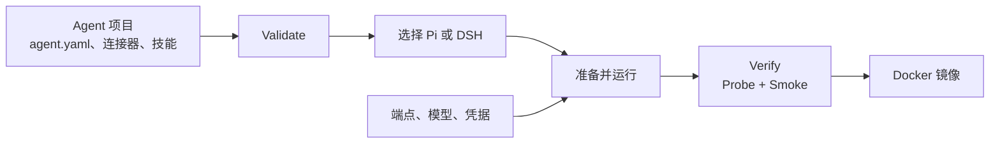

# agent-base

**把一组描述 agent 的文件，变成一个经过检查、可以放进 Docker 运行的镜像。**

[English README](README.md)

## agent-base 是什么？

`agent-base` 是开发和测试 AI agent 的工具包，也是可复用的基础 Docker 镜像。

你把 agent 的工作说明、模型设置、工具、连接器和技能放进一个目录。这个仓库提供命令来完成下面几件事：

1. 检查定义是否完整、引用是否正确；
2. 准备执行它的程序需要读取的文件；
3. 先用内置测试网关运行，也可以连接真实模型端点；
4. 检查声明的工具和权限是否真的生效；
5. 把同一份定义打包成 Docker 镜像（OCI 格式），交给 CI 或部署环境。

目标很直接：你在电脑上测试的 agent，放进容器后仍然是同一个 agent。

`agent-base` **不是**模型、在线聊天产品、API 网关，也不是多租户业务系统。它是这些应用下面的构建、运行和验证层。

## 适合谁？

它适合需要下面这些能力的团队：

- 用统一目录和命令维护多个 agent；
- 把 agent 的文件和执行它的程序分开；
- 在本地和受限容器里运行同一个 agent；
- 在发布前发现工具缺失、权限错误、连接器故障和凭据泄漏；
- 需要时对比两个执行程序的实际行为，确认它们是否兼容。

如果你只是想在一个短脚本里调用一次模型，这个仓库可能太重了。

## 一次运行会经过什么？

```text
agent.yaml + 连接器 + 技能
              │
              ▼
       make validate        定义是否完整、一致？
              │
              ▼
       make verify          渲染后的 agent 是否真的能启动和工作？
              │
              ▼
       make run-local       用假网关或真实端点实际跑一次
              │
              ▼
       Docker 镜像 + CI     发布前重新构建并验证同一份产物
```

这些检查是分开的。“进程启动了”不等于 agent 可用。检查还会确认实际加载了什么、能使用哪些工具、执行程序能否访问预期网关，以及一次真实请求能否产生报告和轨迹。

## 快速开始

要求：Node.js 24+、GNU Make 和 Docker。macOS 可以使用 OrbStack。完整生产验收在带 Docker、QEMU 和回环网络的 Linux CI runner 上执行。

在本仓库中执行：

```bash
npm ci
make dev-env
make local-packages
make local-packages-check

# 检查基座仓库本身
make validate
make validate-selftest

# 快速本地回归；部分容器重检查会明确标记为跳过
npm test
```

在基座仓库之外创建一个 agent 项目：

```bash
make new-agent NAME=release-review DESCRIPTION="审查发布风险"
cd ../release-review

make validate
make verify HARNESS=pi
make run-local PROMPT="审查这次发布的运行风险"
```

连接真实模型端点时，在命令调用时传入部署参数。不要把密钥写进 `agent.yaml`、生成文件或 Git：

```bash
make run-local \
  ENDPOINT=https://your-gateway.example/v1 \
  API_KEY='<secret>' \
  PROMPT='审查这次发布的运行风险'
```

## 检查什么？

`make verify` 会依次执行四类检查：

1. **Validate**：agent 文件、引用、工具和设置是否合法；
2. **Doctor**：执行程序报告准备好的 agent 里实际包含了什么；
3. **Probe**：执行程序能否启动，并在没有供应商密钥时访问内置测试网关；
4. **Smoke**：一次端到端请求能否产生报告和轨迹。

发布验收还要构建两种镜像架构并执行完整回归：

```bash
node core/image/build.mjs --all --debug
node core/image/build.mjs --manifest
node tools/regression.mjs --json
```

完整验收必须以退出码 `0` 结束，并报告 `failed: []`、`skipped: []`。`npm test` 是更快的开发检查，不能替代完整命令。

## 执行 agent 的两个程序

agent 目录里的文件本身不是模型，也不是可以直接启动的命令行程序。它们需要由一个执行程序读取；执行程序负责加载说明和工具，再调用模型。`agent-base` 目前支持两个执行程序：

大多数用户从 **Pi** 开始即可。只有在明确需要 DeepSeek 命令行或 MCP 行为时，才选择 **DSH**。使用 `make validate`、`make verify` 和 `make run-local` 这条基本流程，不需要先了解这两个程序的内部实现。

| 程序 | 包 | 什么时候用 |
|---|---|---|
| **Pi** | `@earendil-works/pi-coding-agent@0.87.1` | 默认路径 |
| **DSH** | `@deepseek-ai/dsh@0.1.7-rc.1` | 需要 DeepSeek CLI/MCP 路径 |

两个程序都必须通过同一套 C1–C10 行为检查。它们的集成代码放在 `adapters/`，共享的检查和镜像代码放在 `core/`。

## 各部分如何连接



Agent 项目描述“要做什么”。Pi 或 DSH 读取这些文件并调用模型。这些检查会验证实际结果。镜像只打包结果，不会把宿主机凭据一起复制进去。

## 仓库目录

- `core/`：共享的 schema、检查、轨迹、镜像启动和安全检查；
- `adapters/`：Pi 和 DSH 的集成；
- `template/`：新 agent 项目的起始目录；
- `examples/`：可以直接阅读和运行的完整示例；
- `tools/`：`validate`、`verify`、`run-local`、`regression` 等命令入口；
- `docs/`：设计决定、验证细节和生产 CI 契约。

修改仓库前先读 [`AGENTS.md`](AGENTS.md)。需要完整验证规则时，从 [`docs/14-how-to-verify.md`](docs/14-how-to-verify.md) 开始。

## 安全和部署

- 构建阶段可以下载固定版本依赖；运行期验证支持断网执行；
- 端点、模型和凭据在 agent 运行时传入，不写进镜像；
- 子进程只接收明确允许的环境变量；
- 镜像使用非 root 用户运行。容器验证使用只读根文件系统、丢弃 Linux capabilities 和明确的临时文件系统；
- 假网关让 CI 可以在没有供应商密钥的情况下跑完整流程；
- 如果凭据曾经提交过，必须同时清理 Git 历史，并在供应商平台撤销或轮换旧密钥。

## 生产验收

`.github/workflows/production-acceptance.yml` 会在真实 Linux runner 上执行本地无法完整模拟的检查：Docker、回环网络、QEMU、两种镜像架构、OCI manifest 和完整回归，并把结构化回归报告上传为 workflow artifact。

本地 OrbStack 检查适合开发时使用。发布检查使用 GitHub workflow，因为它运行在生产要求的环境中。

## License

见 [`LICENSE`](LICENSE)。
