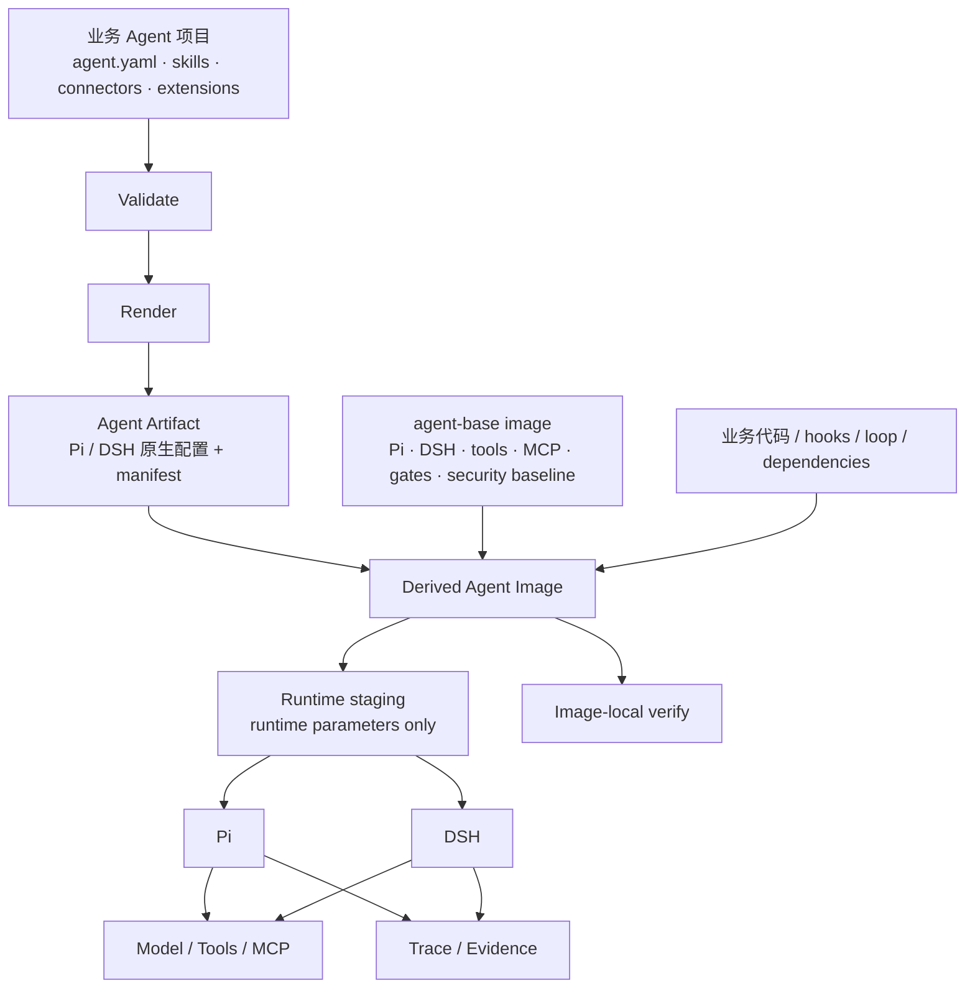

# agent-base

**`agent-base` 是一个用于构建和交付业务 AI Agent 的基座容器镜像。**

[English](README.md)

基座镜像里已经放好了两套 Agent Runtime（Pi 和 DSH）、通用工具链、常用 MCP Server 的依赖包、启动逻辑、验证工具和容器安全基线。它本身**不包含任何业务 Agent**。

真正的业务 Agent 以它为底座：

```dockerfile
FROM ghcr.io/uukuguy/agent-base:0.1.0

# 加入渲染后的 Agent 产物
# 加入业务代码 / Hook / Loop 扩展
# 加入业务自己的依赖
```

最后得到的是你自己的 Agent 镜像。

```text
agent-base 基座镜像
├── Pi / DSH（固定版本）
├── 通用工具链与预装 MCP
├── 启动与运行时隔离
├── 四级验证
└── 非 root / 离线检查 / 镜像一致性等基线
          │
          │ FROM
          ▼
      my-agent 镜像
      ├── Agent Artifact
      ├── Skills / Connectors
      ├── 业务代码
      ├── Hooks / Loop 扩展
      └── 业务依赖
```

这个仓库不只是一个 Dockerfile。它同时提供 Agent 项目模板、定义规范、Pi / DSH Adapter、渲染器、验证工具、Trace、Conformance 和派生镜像构建流程。

开发时，你维护的是一个普通 Agent 项目；交付时，它会变成一个基于 `agent-base` 的独立镜像。开发机、CI、测试和部署使用的是同一份 Agent 产物和同一套运行规则。

`agent-base` 也不是新的 Agent Framework。真正执行 Agent Loop 的仍然是 Pi 或 DSH。

---

## 为什么不是直接用 Pi / DSH，再自己写一个 Dockerfile？

如果你的需求只是写 Prompt、加几个 Skills、接几个 MCP，然后在自己的机器上跑起来，**并不需要 agent-base**。直接配置 Pi 或 DSH 更简单。

`agent-base` 解决的是另一类问题：当 Agent 开始成为一个需要长期开发、升级、测试和交付的软件系统时，很多团队会反复重做同一套基础工程，而且很难知道自己到底验证了什么。

### 1. 不只检查“配置写出来了”，而是检查“运行时真的这样工作”

一份 YAML 或 JSON 生成成功，只能说明文件存在，不能说明 Pi / DSH 真正采用了它。

`agent-base` 的验证会继续启动真实 Harness，并检查：

- 声明的 Skill 是否真的被加载；
- Connector 是否真的注册并能启动；
- Tool deny 是否真的限制了工具；
- Hook 是否真的触发并留下证据；
- 一个完整请求是否在这些约束下跑通。

`make verify` 按顺序执行四级检查：

| 阶段         | 回答的问题                                |
| ------------ | ----------------------------------------- |
| **Validate** | Agent 定义本身是否合法，引用是否完整      |
| **Doctor**   | 渲染结果能否被真实 Harness 正确解析和装载 |
| **Probe**    | Runtime、工具和连接器是否真正可用         |
| **Smoke**    | 完整请求是否能跑通，并产出报告和 Trace    |

默认路径使用本地测试网关，因此模型检查可以**不使用真实模型凭据**完成。外部 Connector 仍然需要可访问的服务或测试替身。

不能确认的能力不会因为“没报错”就算成功，而是明确标成 `unverified`。

### 2. 把交付规则做进基座，而不是靠每个项目自己记住

Agent 很容易在开发机上能跑，换到 CI 或容器里就变成另一套东西。

`agent-base` 把一些容易反复踩坑的规则做成基座约束：

- Agent 行为随制品版本化，Endpoint、Key、Workspace 等环境参数运行时再注入；
- 渲染产物只读，运行时需要修改时先进入 staging，不直接改交付制品；
- 缺配置、能力不支持或声明不认识时显式失败，不静默降级；
- 基座默认以非 root 用户运行；
- 容器验收会检查离线依赖、权限边界和文件系统约束；
- 基座镜像记录构建输入指纹，用来发现“源码已经变了，镜像还是旧的”这类漂移。

这些不是编码规范，而是可以自动检查的条件。

### 3. 同一个业务 Agent 可以落到不同 Runtime，差异必须说清楚

Pi 和 DSH 的原生机制并不一样。Skill、工具限制、MCP、Hook、扩展方式都有差异。

`agent-base` 不试图把它们伪装成完全相同的 Runtime，而是把业务层能共用的部分定义一次，由 Adapter 分别渲染成 Pi / DSH 的原生形态。

能等价实现的能力必须通过验证；做不到等价的地方必须显式声明，不能悄悄忽略。

因此第二个 Runtime 的意义不只是“多支持一个 Harness”，而是让“这个 Agent 是否真的可移植”变成可以测试的问题。

### 4. 业务镜像可以在交付后自己证明“没有被改坏”

基座镜像里带着验证所需的 Gate。业务镜像在 `FROM agent-base` 后加入自己的 Artifact、代码和 Hook，仍然可以直接在镜像内部做验证。

`make image-derived` 会完成派生镜像构建，并执行镜像内自证。验证可以在没有真实模型凭据的情况下运行。

业务项目的 CI 可以调用这个命令，验收**最终要交付的业务镜像**。本仓库的生产验收工作流检查的是共享基座镜像。

---

## 开发时是项目，交付时是镜像

业务开发不需要进入 `agent-base` 仓库修改代码。每个 Agent 都是一个独立项目：

```text
workspace/
├── agent-base/
└── my-agent/
    ├── agent.yaml
    ├── connectors.yaml
    ├── skills/
    ├── harness/          # 可选：Pi / DSH 专有扩展
    └── Makefile
```

最小的 `agent.yaml` 可以很简单：

```yaml
apiVersion: agent-base/v1
name: my-agent
description: A focused business assistant

persona:
  instructions: |
    你是一个重视证据的业务助手。
    不确定时明确说明，不要编造事实。

model:
  provider: deepseek
  name: deepseek-flash

# 可选
# tools:
#   deny: [bash]
```

项目里保存的是会改变 Agent 行为的内容，例如 Instructions、Skills、Connector 声明、工具边界和 Harness 扩展。

API Key、Endpoint、Workspace、部署环境对应的模型名等值不应该烤进业务定义，而是在运行时提供。

从项目到交付镜像的路径大致如下：

```text
my-agent/
   │
   ├─ validate
   │
   ├─ render
   ▼
Agent Artifact
   │
   ├─ Pi native config
   ├─ DSH native config
   ├─ manifest
   └─ verification metadata
   │
   │ + agent-base image
   ▼
my-agent image
   │
   ├─ run
   └─ verify
```

---

## 快速开始

### 环境要求

- Node.js 24+
- GNU Make
- Docker
- macOS 可使用 Docker Desktop 或 OrbStack

### 1. 准备基座开发环境

```bash
git clone https://github.com/uukuguy/agent-base.git
cd agent-base

npm ci
make dev-env
make local-packages
make local-packages-check
```

`make dev-env` 会按仓库中的版本 pin 准备 Pi / DSH；本地 Package 步骤用于准备与基座镜像一致的依赖。

### 2. 创建一个业务 Agent

```bash
make new-agent NAME=my-agent DESCRIPTION="My business assistant"
cd ../my-agent
```

然后修改：

```text
agent.yaml
connectors.yaml
skills/
```

先跑本地验证：

```bash
make validate
make verify
```

`make verify` 默认不要求真实模型 Key，也不会拿业务答案做“正确性判断”。它检查的是 Agent 的定义、装载、运行和工程边界。

### 3. 接真实模型

Provider / Model 在项目里声明，Endpoint 和凭据在运行时提供：

```bash
make run-local \
  ENDPOINT=https://your-gateway.example/v1 \
  API_KEY='<secret>' \
  PROMPT='分析这次变更的主要风险。'
```

真实凭据不要提交进项目文件或 Git。

Ollama、vLLM、LM Studio 等 OpenAI-compatible 服务也可以作为本地或私有模型端点使用。Provider 和模型配置见 [Quickstart](docs/01-quickstart.md)。

### 4. 构建交付镜像

回到 `agent-base` 仓库：

```bash
make image
make image-derived AGENT_DIR=../my-agent
```

`make image` 构建基座镜像；`make image-derived` 把业务 Agent 的渲染产物和可选 Overlay 加到基座之上，并在最终镜像内部执行验证。

默认基座标签与主机架构一致。使用 registry 上的镜像时，可以传入 `BASE_IMAGE=registry.example.com/team/agent-base:0.1.0`；如果该标签支持多架构，Docker 会自动选择匹配的架构。

---

## Pi 和 DSH 在这里是什么关系？

Pi 和 DSH 是真正执行 Agent Loop 的 Runtime，不是模型 Provider。

`agent-base` 当前把 Pi 作为默认 Runtime，同时维护 DSH Adapter：

|          | Pi                                 | DSH                            |
| -------- | ---------------------------------- | ------------------------------ |
| 定位     | 默认 Runtime                       | 第二个受支持 Runtime           |
| 业务定义 | `agent.yaml` / Skills / Connectors | 同一份业务定义                 |
| 适配代码 | `adapters/pi/`                     | `adapters/dsh/`                |
| 专有扩展 | Pi Extensions / CLI / 配置机制     | Cordis / Profile / Plugin 机制 |

可以分别验证：

```bash
make verify HARNESS=pi
make verify HARNESS=dsh
```

两边的实现方式不要求一样，但共同声明的能力必须能被各自验证。真实差异会保留在 Adapter 和 Exemption 中，不会为了“统一接口”把差异藏起来。

当前能力和差异见 [Runtime selection facts](docs/design/2026-09-27-runtime-selection-facts.md)。

---

## 四级验证不是业务 Eval

`usable` 的含义很窄：**在当前测试条件下，这个 Agent 通过了 agent-base 的工程验证。**

它不会替你判断合同分析对不对、电网风险评估好不好、隐私识别准不准。

这些属于业务 Eval，需要自己的数据集、判据和验收流程。

工程验证和业务 Eval 是两层不同的问题：前者回答“系统有没有按声明工作”，后者回答“工作结果好不好”。

---

## 行为进制品，环境参数留到运行期

`agent-base` 采用一条简单的分界：

> 会改变 Agent 基本行为的内容进入版本化制品；与部署环境有关的值留到运行期。

通常进入 Agent Artifact 的内容包括 Instructions、Skills、Connector 声明、工具边界、Harness 专有扩展，以及允许使用的 Capability Bundles。

通常留在运行时的内容包括 API Key / Token、模型 Endpoint、环境对应的模型名、Workspace、Permission Mode，以及从制品允许集合中选择的 Active Bundles。

这样，同一个 Artifact 从开发机进入 CI、测试和生产时，不需要靠一大组没人追踪的环境变量重新定义一遍 Agent。

---

## Skill、Connector、Capability 和深度扩展

**Skill** 属于业务 Agent，用来承载任务知识、操作流程和必要脚本。

**Connector** 用于连接外部系统，当前主要是 MCP。项目只声明需要什么，Adapter 负责转成目标 Runtime 的原生配置。

**Capability Bundle** 是一组具名能力。制品记录允许使用的 Bundle，运行时只能从这个集合里激活；写错或选择未声明的 Bundle 会直接失败。

**Harness Extension / Overlay** 用来承载 Pi / DSH 专有扩展、业务代码和 Hook。需要更深的定制时，可以继续在 Derived Image 里加入 Loop、服务层和自己的依赖。

基座不会用公共 Schema 限制业务层只能做“最小交集”。它只对自己能够稳定验证的部分做保证；允许但暂时无法证明的能力会明确标为 `unverified`；业务自己的策略与服务实现由业务层负责。

详细边界见 [Developer contract](docs/13-developer-contract.md)。

---

## 容器模型

基座和业务层明确分开：

| 层                      | 内容                                                        |
| ----------------------- | ----------------------------------------------------------- |
| **agent-base image**    | Pi / DSH、工具链、预装 MCP、启动器、验证 Gate、安全基线     |
| **Agent Artifact**      | 中性定义渲染后的 Runtime 原生配置、Manifest 和验证元数据    |
| **Derived Agent Image** | `FROM agent-base` + Agent Artifact + 业务代码 / Hook / 依赖 |

基座镜像默认以非 root 用户运行，并支持 `linux/amd64` 与 `linux/arm64`。生产镜像和 Debug 镜像分开构建。

Artifact 在交付后保持只读；Runtime 如果需要生成临时配置，会在 staging 中完成，不直接修改制品。

派生镜像中同时保留镜像内验证能力，因此加入业务代码之后仍然可以重新证明基础契约没有被破坏。

部署细节见 [Deployment](docs/06-deploy.md)。

---

## 架构



仓库结构与这套边界对应：

| 目录            | 主要职责                                           |
| --------------- | -------------------------------------------------- |
| `core/`         | 公共定义、Catalog、Gate、Trace、运行规则和镜像逻辑 |
| `adapters/pi/`  | Pi 渲染、启动、Doctor、Trace 和专有适配            |
| `adapters/dsh/` | DSH 渲染、启动、Doctor、Trace 和专有适配           |
| `conformance/`  | Runtime 与容器的阻断式合规检查                     |
| `template/`     | `make new-agent` 使用的业务项目模板                |
| `examples/`     | 可运行的参考项目                                   |
| `tools/`        | Make 命令背后的实现                                |
| `docs/`         | 使用说明、设计决策和验证契约                       |

公共逻辑放 `core/`，Runtime 专有逻辑放 `adapters/<harness>/`，业务代码留在业务项目和派生镜像里。

---

## 示例

仓库提供几组完整项目：

| 场景                         | 示例                                                         |
| ---------------------------- | ------------------------------------------------------------ |
| 合同条款审查、连接外部系统   | [`examples/contract-review`](examples/contract-review)       |
| 变更风险评估、自定义业务工具 | [`examples/change-risk-review`](examples/change-risk-review) |
| 敏感信息识别与脱敏检查       | [`examples/privacy-redaction`](examples/privacy-redaction)   |
| Ollama / vLLM 等本地模型     | [`examples/local-model-dev`](examples/local-model-dev)       |
| 同一 Agent 在多环境中运行    | [`examples/multi-env-rollout`](examples/multi-env-rollout)   |

这些示例主要展示工程结构和接入方式，不代表业务效果已经得到验证。

---

## agent-base 不负责什么

`agent-base` 不是模型网关、可视化 Agent Builder、业务工作流平台或多租户 SaaS 控制面，也不负责业务 Eval、鉴权、计费、HA 和用户生命周期。

这些能力可以在派生镜像或更上层的平台中实现。

如果你的程序只是调用一次模型 API 的简单脚本，直接使用 Provider SDK 通常更合适。`agent-base` 面向的是需要持续开发、验证、升级和交付的 Agent 系统。

---

## 文档

- [Quickstart](docs/01-quickstart.md) — 创建、验证和运行 Agent
- [Concepts](docs/02-concepts.md) — 中性定义以及 Pi / DSH 映射
- [Capability catalog](docs/03-capability-catalog.md) — 当前能力面
- [Deployment](docs/06-deploy.md) — 基座镜像、运行参数和 Derived Image
- [Developer contract](docs/13-developer-contract.md) — 基座保证什么、不保证什么
- [How to verify](docs/14-how-to-verify.md) — 验证流程、报告和边界
- [CI production acceptance](docs/15-ci-production-acceptance.md) — Linux 上的仓库级验收
- [Current state](docs/status/CURRENT-STATE.md) — 当前实现和已知问题

`docs/design/` 记录具体架构决策和 Runtime 实测结论。自动生成的 Catalog / Facts 应从真源重新生成，不建议直接手改。

---

## 当前状态

`agent-base` 仍在持续开发。当前已经形成基座镜像、Pi / DSH Adapter、四级验证、统一 Trace、Capability Bundles、容器 Conformance、Derived Image 和镜像内自证链路。

还没有进入稳定契约、或者暂时没有可靠判据的能力，会继续明确标为 incomplete / unverified，而不是提前写成“已支持”。
