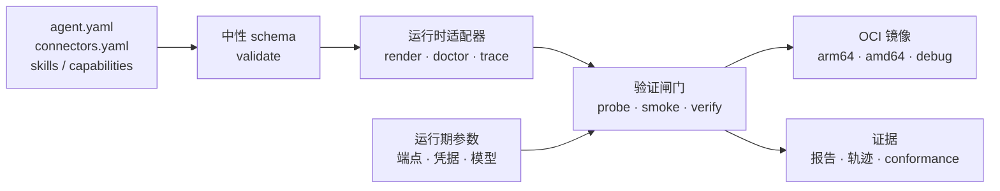

# agent-base

**定义、验证和打包可移植 AI 智能体。**

agent-base 把智能体定义和执行它的运行时分开。你只需描述一次智能体，再通过固定版本的运行时适配器渲染、通过四道验证闸门、把同一份有证据支撑的产物打包成加固 OCI 镜像。

[English README](README.md)

## 为什么需要 agent-base

很多智能体项目不是失败在模型调用，而是失败在边界：本地与容器配置漂移、凭据进入产物、运行时专有能力变成隐藏依赖，以及“进程启动了”被误当成“智能体可用”。

agent-base 把这些边界变成明确契约：

- **可移植定义**：业务意图不绑定某个运行时。
- **运行时适配器**：把定义翻译成固定版本的 harness，并暴露真实能力。
- **可执行验证闸门**：把“技能已加载”“镜像可断网运行”等声明变成证据。
- **版本化构建**：构建期固定行为和声明的包版本，运行期注入部署参数。
- **结构化轨迹和报告**：失败可以归因，不会静默消失。

## 架构



`core/` 保持运行时中立，运行时专有实现位于 `adapters/<runtime>/`。当前适配器如下：

| 运行时 | 固定版本 | 定位 |
|---|---|---|
| **Pi** | `@earendil-works/pi-coding-agent@0.87.1` | 主路径，支持无头发现与验证 |
| **DSH** | `@deepseek-ai/dsh@0.1.7-rc.1` | 对比路径，提供原生权限与 MCP 行为 |

两侧共同通过 C1–C10 阻断性 conformance 套件。

## 适用场景

- 从小而可审查的中性定义构建企业内部智能体。
- 在本地和受控容器中运行同一份定义。
- 把技能、连接器、能力实现和固定依赖打成 OCI 产物。
- 使用内置假网关在零凭据下验证运行路径。
- 对比不同运行时，明确记录不等价处。
- 为自动化评审提供机器可读计划、报告、轨迹和失败原因。

业务应用在仓库之外派生，并通过这里定义的命令面使用基座。鉴权、多租户、服务编排和供应商账户管理由应用或部署平台负责。

## 快速开始

要求：Node.js 24+、GNU Make 和 Docker。macOS 可使用 OrbStack；生产验收在具备 Docker、QEMU 和回环网络的 Linux CI runner 上执行。

```bash
# 安装工具链依赖
npm ci

# 全局安装固定版本运行时，并在仓库内安装连接器
make dev-env
make local-packages
make local-packages-check

# 校验仓库契约
make validate
make validate-selftest

# 快速本地回归（会明确报告跳过的容器项）
npm test
```

创建并验证一个智能体：

```bash
make new-agent NAME=my-agent DESCRIPTION="审查发布风险的智能体"
cd ../my-agent

make validate
make render HARNESS=pi
make verify HARNESS=pi
```

真实端点的部署参数在调用时传入。不要把凭据写进 `agent.yaml`、生成物或 Git 历史：

```bash
# 对已检出的 agent 上下文执行。
make run-local \
  ENDPOINT=https://your-gateway.example/v1 \
  API_KEY='<secret>' \
  PROMPT='审查这次发布的运行风险'
```

## 验证模型

“进程启动了”不是验收标准。四道闸门是：

1. **Validate**：schema、引用、能力声明、参数分层和命名。
2. **Doctor**：渲染产物报告实际包含的内容。
3. **Probe**：运行时启动、加载声明面并连接零凭据假网关。
4. **Smoke**：端到端请求产生可用报告和轨迹。

构建镜像后执行完整本地验收：

```bash
node core/image/build.mjs --all --debug
node core/image/build.mjs --manifest
node tools/regression.mjs --json
```

完整验收必须返回退出码 `0`、`failed: []` 和 `skipped: []`。Pi 与 DSH 分别执行 C1–C10 准入检查。`npm test` 使用 `--fast`，会跳过部分容器项，但仍执行 conformance，因此需要 Docker，不能替代完整验收。

## 镜像与运行期边界

- 构建期可以联网；运行期验证在断网条件下执行。
- 端点、模型和凭据等运行期参数显式注入，不进入不可变产物。
- 子进程只接收 allowlist 环境变量，不继承宿主全部环境。
- 镜像使用非特权用户。受控容器验证施加能力丢弃、只读根文件系统和显式临时文件系统；部署时也应应用这些约束。
- 调试镜像是独立产物，生产模式拒绝调试运行。

多架构产物写入 `dist/image/agent-base-0.1.0.oci.tar`，生产 CI 同时上传结构化回归证据。

## 仓库结构

```text
core/                 运行时中立 schema、闸门、轨迹和镜像逻辑
adapters/pi/          Pi 渲染、doctor、运行器、轨迹映射、自检
adapters/dsh/         DSH 渲染、doctor、运行器、轨迹映射、自检
conformance/          C1–C10 阻断性运行时准入套件
template/             起步智能体定义和 Makefile
examples/             端到端业务示例
tools/                命令面、假网关、验证和生成器
docs/                 设计、契约、运维、故障排查和状态
.github/workflows/    生产 Docker/QEMU 验收
```

## 安全与凭据卫生

不要提交 `.env`、API key、token、登录态或连接器凭据。`make hygiene-selftest` 检查凭据卫生，包括可达 Git 历史中的明显凭据值；这是有限检查，不能替代完整的 secret scanner。清理仓库不能撤销供应商侧凭据；如果真实 key 曾经暴露，必须先在供应商平台撤销并轮换。


## CI 与生产验收

`.github/workflows/production-acceptance.yml` 在 Linux runner 上执行：

1. 安装固定版本的本地预装包；
2. 检查 Docker 和回环网络；
3. 构建双架构生产/调试镜像；
4. 生成 OCI manifest；
5. 执行 `node tools/regression.mjs --json`；
6. 上传 `regression.json`。

配置 Git remote 后，可通过 `workflow_dispatch`、push 或 pull request 触发。配置方式和证据要求见[生产验收指南](docs/15-ci-production-acceptance.md)。

## 文档

- [验证指南](docs/14-how-to-verify.md)
- [生产验收](docs/15-ci-production-acceptance.md)
- [设计与代码评审](docs/reviews/2026-09-30-agent-base-design-code-review.md)
- [开发者契约](docs/13-developer-contract.md)
- [运行时适配契约](docs/09-harness-contract.md)
- [运行时选型事实](docs/design/2026-09-27-runtime-selection-facts.md)
- [当前状态与交接](docs/status/RESUME-NEXT-SESSION.md)
- [仓库 Agent 协作说明](AGENTS.md)

## 许可证

本仓库尚未声明开源许可证。
