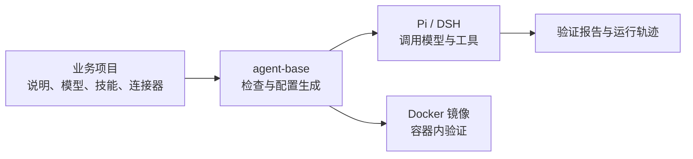

# agent-base

**用于开发、运行和验证 AI 智能体的工具与基础镜像。**

[English](README.md)

使用 agent-base，你可以创建一个合同审查、代码检查或数据脱敏智能体，为它配置工作说明、模型、工具和技能，在本地试跑，再放进 Docker 中验证。

你负责智能体的业务内容；agent-base 提供项目模板、运行命令、自动检查、运行记录和容器环境。每个业务项目有自己的目录，通过同一套命令开发和测试。

## 可以用它做什么？

仓库里提供了完整示例，可以从接近你需求的项目开始：

| 你要做的事 | 示例 |
|---|---|
| 审查合同条款，并接入外部系统 | [合同审查](examples/contract-review/) |
| 分析变更风险，增加自己的业务工具 | [变更风险评审](examples/change-risk-review/) |
| 识别敏感信息，检查脱敏结果 | [隐私脱敏](examples/privacy-redaction/) |
| 使用 Ollama、vLLM 等本地模型服务 | [本地模型开发](examples/local-model-dev/) |
| 让同一份智能体配置适用于多个环境 | [多环境配置](examples/multi-env-rollout/) |

这些是参考实现。你需要根据实际业务修改工作说明、技能或代码，并用自己的任务评估结果质量。

## 为什么使用 agent-base？

开发智能体不只有写提示词。还要安装工具、接入模型和外部服务、管理权限、记录调用过程，并确认放进容器后仍然能用。

agent-base 把这些重复工作集中起来：

- **少写一套基础设施**：模板、常用工具和连接器已经准备好，新项目可以沿用现有命令。
- **配置后能确认是否生效**：自动检查实际加载的技能、工具和连接器，发现缺失时给出失败原因。
- **本地测试更少受个人环境影响**：隔离配置目录，避免无意间使用开发者电脑上的登录态或额外技能。
- **发布前检查容器里的行为**：验证镜像与源码一致，并检查断网运行、非 root 用户和权限限制。
- **保留排错依据**：生成验证报告和调用轨迹，方便检查失败发生在哪一步。
- **可以比较不同 agent 软件**：同一份业务定义可交给 Pi 或 DSH 执行；不兼容的部分会明确报告。

自动检查验证的是配置和运行链路。合同分析是否正确、风险判断是否可靠，仍需要业务测试来确认。

## 设计思路

### 业务项目独立于基座

智能体项目通常由以下文件组成：

```text
my-agent/
├── agent.yaml       # 工作说明、模型选择和工具限制
├── connectors.yaml  # 外部服务连接配置
├── skills/          # 任务说明，以及需要的业务脚本
└── Makefile         # validate、verify、run-local 等命令
```

你在自己的项目里开发业务。基座提供共享工具，新增一个智能体不需要复制整套基础代码。

### 先定义，再运行，再验证

agent-base 读取这些文件，为选定的 agent 软件生成配置，再启动并检查它。这样可以把“文件里写了什么”和“程序实际加载了什么”放在一起核对。

### 业务内容和部署凭据分开

工作说明、技能和工具配置随项目一起管理。模型服务地址和密钥在运行时传入，避免把测试环境凭据写进镜像。

## 快速开始

准备 Node.js 24+、GNU Make 和 Docker。macOS 可以使用 OrbStack。

### 1. 安装开发依赖

```bash
git clone https://github.com/uukuguy/agent-base.git
cd agent-base
npm ci
make dev-env
make local-packages
make local-packages-check
```

`make dev-env` 安装固定版本的 Pi 和 DSH；`make local-packages` 安装本地检查需要的连接器依赖。

### 2. 创建并检查一个智能体

```bash
make new-agent NAME=my-agent DESCRIPTION="我的业务助手"
cd ../my-agent

make validate
make verify
```

新项目创建在 `agent-base` 的同级目录。修改 `agent.yaml` 中的工作说明和模型设置，再按需要补充技能和连接器。

`make validate` 检查文件与引用。`make verify` 使用本地测试网关检查启动和调用流程，不需要真实模型密钥；它不会判断你的业务回答是否正确。

### 3. 使用真实模型试跑

先在 `agent.yaml` 中设置你的供应商和模型；需要新增供应商或查询可用模型时，参见[快速上手](docs/01-quickstart.md)和[模型配置](docs/02-concepts.md)。然后执行：

```bash
make run-local \
  ENDPOINT=https://your-gateway.example/v1 \
  API_KEY='<secret>' \
  PROMPT='请完成我的测试任务'
```

`make run-local` 需要实际可用的模型端点。不要把真实密钥写进项目文件或 Git。

## Pi 和 DSH 是什么？

它们是两个已有的 agent 软件：负责调用模型、执行模型选择的工具，并继续处理结果。它们和 DeepSeek、OpenAI 等**模型供应商**是不同的概念。

agent-base 在它们之上提供统一的项目文件和检查命令，默认使用 **Pi**。如果需要验证同一项目在 **DSH** 下的行为，可切换命令参数：

```bash
make verify HARNESS=pi
make verify HARNESS=dsh
```

`HARNESS` 表示选择哪个 agent 软件。基本流程只需使用默认值；更换供应商或模型不等于必须更换 Pi/DSH。

| 软件 | 固定版本 |
|---|---|
| Pi | `@earendil-works/pi-coding-agent@0.87.1` |
| DSH | `@deepseek-ai/dsh@0.1.7-rc.1` |

两者使用同一套准入检查，但扩展机制和部分能力不同。差异见[运行时选型材料](docs/design/2026-09-27-runtime-selection-facts.md)。

## 架构



| 目录 | 作用 |
|---|---|
| `core/` | 共享的定义规则、验证流程、报告、轨迹和镜像逻辑 |
| `adapters/` | 将项目文件转换为 Pi、DSH 的配置，并接入各自的运行与记录方式 |
| `template/` | 新智能体项目的模板 |
| `examples/` | 完整的业务参考项目 |
| `tools/` | 命令入口 |
| `docs/` | 使用指南、设计与验证说明 |

## 验证与容器

`make verify` 执行四步检查：

| 检查 | 回答的问题 |
|---|---|
| Validate | 定义是否有效，引用是否存在？ |
| Doctor | 生成的配置是否包含预期内容？ |
| Probe | 程序能否启动，工具是否加载，能否访问测试网关？ |
| Smoke | 一次测试请求能否完成，并留下报告和轨迹？ |

容器验证还会检查只读根文件系统、非 root 用户、被移除的 Linux 权限，以及默认断网时的行为。基座镜像支持 `linux/amd64` 和 `linux/arm64`，调试镜像单独构建。

维护基座时，在仓库根目录执行完整回归：

```bash
node core/image/build.mjs --all --debug
node core/image/build.mjs --manifest
node tools/regression.mjs --json
```

通过标准：退出码 `0`，`failed: []`，`skipped: []`。`npm test` 是较快的开发检查，仍需 Docker，并会明确跳过部分容器检查。

GitHub 的[验收工作流](.github/workflows/production-acceptance.yml)在 Linux runner 上构建和检查镜像，保存结构化报告。构建镜像需要下载依赖；断网检查验证的是容器内依赖是否齐备，不代表真实模型调用可以离线完成。

## 适用范围

agent-base 适合需要持续开发、测试和比较业务智能体的团队。它提供接近部署环境的验证条件，以及构建业务镜像的基础。

鉴权、多租户、人工审批、高可用和常驻服务编排由业务应用或部署平台负责。如果只是用一个短脚本调用模型，可以直接使用供应商 SDK。

## 继续阅读

- [快速上手](docs/01-quickstart.md)：模型配置、本地运行和登录方式。
- [能力目录](docs/03-capability-catalog.md)：可配置的工具与能力。
- [故障排查](docs/07-troubleshooting.md)：配置了却没有生效时如何检查。
- [部署说明](docs/06-deploy.md)：业务镜像和运行参数。
- [验证指南](docs/14-how-to-verify.md)：命令、期望结果和边界。
- [CI 验收说明](docs/15-ci-production-acceptance.md)：runner 要求和验收顺序。
- [AGENTS.md](AGENTS.md)：修改本仓库时的协作约定。

## License

见 [LICENSE](LICENSE)。
