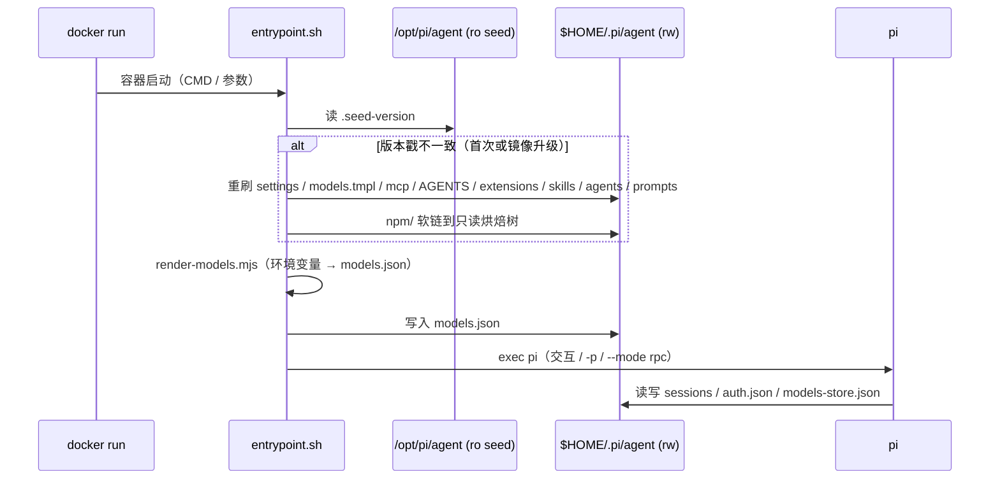

# pi-agent-base 设计方案（评审稿）

| | |
|---|---|
| 状态 | **设计待评审**。另有一版预研原型用于验证可行性（证据在附录 C），**不作为评审依据** |
| 日期 | 2026-09-25 |
| 底层 harness | pi `@earendil-works/pi-coding-agent@0.87.1`（纯 pi，非 omp） |
| 制品 | `pi-agent-base/`（基线配置 + 基线镜像） |
| 目标 | 为快速完成某个想法的端到端验证，准备好企业智能体的基础设施 |

> **本文已被统一设计整合。** 现行为 [`2026-09-25-unified-agent-base-design.md`](2026-09-25-unified-agent-base-design.md)：本文第一部分 R1–R10 已合并进那份文档的 N1–N29，§2.2 的三个决定被提升为所有适配器共同遵守的模式；**本文 §2.1 的八条实测约束仍是 pi 适配器的唯一事实来源，请继续按实测证据维护**。逐条映射见统一设计附录 A。

---

## 0. 评审请求

### 0.1 本轮评审什么

| 优先 | 评审对象 | 为什么 |
|---|---|---|
| **最高** | §1.2 十条能力要求（R1–R10）：范围对不对、有没有漏 | 范围错了后面全错，且这一层是后续所有取舍的判据 |
| 高 | §1.1 基座与平台的边界划分 | 决定基座做多少、平台做多少；越过界会变成做平台 |
| 高 | §2.2 三个关键取舍 + 附录 A 被否方案 | 这几条不可逆或返工代价高，尤其"配置如何进容器" |
| 中 | §2.1 pi 实测约束是否构成选 pi 的充分理由 | 决定是否值得把 pi 作为长期底座 |
| 中 | 附录 B 中哪些未决项必须在本轮定 | 避免进实现后再回头改需求 |

### 0.2 需要评审人给出的决策

| # | 决策点 | 备选 | 若不同意的后果 |
|---|---|---|---|
| D1 | 基座边界：接受"不做权限体系/审批流/多租户/调度"？ | 接受（建议）／收窄／扩大到含平台能力 | 扩大则工期与复杂度不在本方案估算内，需另行设计 |
| D2 | 配置注入：**构建期扁平化**（可复现，改配置需重建镜像）还是运行期下发（热更，行为随配置漂移）？ | 构建期（建议）／运行期／混合 | 选运行期则 R7 可复现性需用"记录生效配置 digest"来补，且需重新评估安全边界 |
| D3 | 交付形态优先级：先做一次性（人 + CI）还是先做常驻服务（平台接入）？ | 一次性（建议）／常驻／两者同期 | 常驻会引入会话归属、并发、鉴权等编排问题，需要单独一张设计 |
| D4 | 安全下限：R2 剩余缺口（只读根文件系统、出站网络白名单）是否必须在本期补齐？ | 本期补齐／下一期／由运行环境承担 | 若由环境承担，基座需明确"依赖外部强制"并在验收里标注 |
| D5 | 供应链：是否要求 SBOM / 镜像签名 / 私仓镜像 pi 包？ | 需要／不需要／部分 | 需要则基座构建流程要接入 CI，且交付物形态改变 |

### 0.3 需要外部输入（非评审可决）

| # | 输入 | 用途 |
|---|---|---|
| I1 | 企业 LLM 网关的地址与协议（OpenAI / Anthropic 兼容？） | 决定 R1 是否真成立；这是**最可能推翻方案的一条** |
| I2 | 内网能否直连 npm / 拉取公共基础镜像 | 决定构建流程是否需改为私仓 |
| I3 | 第一批专用智能体的场景 | 决定 R4 的实际价值与业务技能清单 |

### 0.4 不在本轮范围

- 具体实现代码（预研原型仅供可行性证据，见附录 C）
- 性能与成本容量规划
- 业务技能的具体内容
- 平台层的编排、鉴权、计费设计

### 0.5 前置假设（若不成立，方案需重做）

| # | 假设 |
|---|---|
| A1 | 企业侧存在 OpenAI 或 Anthropic 兼容的 LLM 网关，且**保真转发工具调用与流式**（很多网关会吞掉 `tools` 字段，这是本方案最大的单点风险） |
| A2 | 交付形态以容器为基础，且允许自定义基础镜像 |
| A3 | 评审通过后才进入正式实现；预研原型不构成既成事实 |

---

## 0.6 阅读指引

本文分两部分，**边界是刻意的**：

| | 内容 | 谁看 | 换掉 pi 是否仍成立 |
|---|---|---|---|
| **第一部分** | 企业智能体基座**应该有的能力**——需求与验收 | 架构/平台评审人，不需要懂 pi | ✅ 成立 |
| **第二部分** | **pi 专有的机制**——实测约束与由它导出的技术决策 | 需要判断"选 pi 是否正确"的评审人 | ❌ 作废，需按新 harness 重新推导 |
| 第三部分 | 交付物构成 | 双方 | 部分 |
| 第四部分 | **预研证据**（可行性验证，非评审依据） | 双方 | — |
| 附录 | 被否方案 / 未决事项 / 预研已验边界 | 双方 | — |

**建议动线**：§1.2 十条要求 → §1.1 边界 → §2.2 取舍 → 附录 A/B → 需要细节时再看第一部分其余部分。

术语：**基座**指所有专用智能体共享的底座（配置、能力、镜像、验证）；**agent-dir** 是 pi 存放全部配置与资源的单一目录。

---

# 第一部分：企业智能体基座应有的能力

> 这一部分与 pi 无关。若将来换掉 harness，这里的要求与验收标准仍然适用。

## 1.1 基座的边界

**是**：让每个专用智能体"不用从空白开始"的共同底座——模型接入、默认安全姿态、可观测、能力扩展点、委派、交付形态、验证手段。

**不是**：权限体系、审批流、多租户、调度与编排平台。这些属于平台层，基座只提供被它们调用的接口（如 RPC）。

判定标准：一条需求若只对某一个智能体成立，就不属于基座。

## 1.2 十条能力要求

| # | 要求 | 为什么基座必须有 |
|---|---|---|
| **R1** | **模型接入与制品解耦**：换端点/换模型不改制品 | 企业网关会变（切供应商、灰度、按环境分端点）。若每次都要重建镜像，验证速度就没了 |
| **R2** | **默认安全姿态**：不信任工作区、写入保护、最小权限运行 | 智能体会执行生成的命令。默认值决定"出事时的下限"，而默认值是最难在事后纠正的 |
| **R3** | **行为可观测**：能看见 agent 实际做了什么 | 验证阶段最常问的是"它到底执行了什么、为什么失败"。没有这一点，调试靠猜 |
| **R4** | **能力可扩展**：加技能/工具/数据源不动主流程 | 每个新想法都需要新的领域知识与数据源；扩展点固定了，专用化才有低成本 |
| **R5** | **上下文隔离与委派**：子智能体 | 长任务里"侦察"与"实现"混在一个上下文会互相污染；委派也是并行探索的前提 |
| **R6** | **交付形态覆盖交互/批处理/常驻** | 同一份能力要能被人用、被 CI 调、被平台接。形态不同但能力应同源 |
| **R7** | **行为可复现**：同一制品 = 同一行为 | 出问题时必须能回答"当时生效的到底是什么配置"，否则无法归因 |
| **R8** | **自证能力**：无需真实凭据即可端到端自检 | 基座自身的回归必须能脱离外部依赖跑；否则每次改动都只能靠人工试 |
| **R9** | **派生成本低**：新智能体只写增量 | 基座的价值等于"省掉多少重复劳动"，派生成本就是它的度量 |
| **R10** | **供应链与运行最小权限**：版本 pin、非 root、默认离线 | 企业交付的底线要求，且必须在基座层一次性解决，不该由每个智能体重做 |

## 1.3 对照表：本方案如何满足

> **状态列的定位**：来自预研原型的实跑结果，作用是**证明方案可行**，不是评审依据。评审对象是 §1.2 的要求本身与 §2.2 的取舍；如果你不同意某条要求，请直接标注，不必受下表"已验证"影响。
>
> 状态口径：**已验证**＝预研中实跑通过；**部分**＝做了但覆盖不全，或只验了加载未验行为；**未实现**＝明确没做。

| # | 实现 | 状态 | 证据 / 缺口 |
|---|---|---|---|
| R1 | `models.json.tmpl` + 启动时渲染；`PI_GATEWAY_{BASE_URL,API_KEY,MODEL,API}` | **已验证** | `make smoke`：镜像不变，仅改环境变量即完成真实 HTTP 往返 |
| R2 | `defaultProjectTrust: "never"`＋写入保护扩展＋非 root(10001)＋`--cap-drop ALL`＋`no-new-privileges`＋`PI_OFFLINE=1` | **部分** | 已有项在 `make verify`/`make smoke` 中通过。**缺口**：未启用只读根文件系统；无出站网络白名单；MCP 凭据治理未做 |
| R3 | `audit-log` 扩展：每次工具调用一行到 stderr，可另存 JSONL | **已验证** | smoke 输出中的 `tool bash {...}` / `ok call_fak 0.0s` 即该扩展产出 |
| R4 | 技能目录 / 扩展目录 / `mcp.json` / `packages` 四类扩展点 | **已验证** | `make doctor` 与 `make verify` 列出 1 技能 4 扩展，无诊断告警；MCP 配置生效（禁安装、0 服务器） |
| R5 | `subagent` 扩展（pi 官方）＋ `agents/{scout,worker}.md` | **部分** | 扩展已被加载（doctor 可见）。**缺口**：未跑过真实委派任务 |
| R6 | entrypoint 参数分派：无参数＝交互；`-` 开头＝pi 参数；其它＝命令 | **部分** | `-p`（一次性）已在 smoke 中验证；`--mode rpc` 已验证零凭据响应 `get_state`。**缺口**：未在容器内跑完整 RPC 会话 |
| R7 | 构建期扁平化成一份 agent-dir 并烘焙进镜像 | **已验证（结构性）** | 配置无运行期叠加路径，同 digest 必然同行为 |
| R8 | `make smoke`：本地假网关，支持流式与工具调用 | **已验证** | 零凭据跑通"模型→工具→模型"完整循环 |
| R9 | 复制目录 + 只改 `agent-dir/` 内文件 | **未验证** | 派生契约已定义，但没有真实派生过一次 |
| R10 | pi 与插件版本精确 pin；`npm ci` 语义的烘焙；默认离线；非 root | **部分** | pin 与非 root 已做。**缺口**：无 SBOM/签名/漏洞扫描；内网私仓方案未定 |

**结论**：基座骨架成立（R1/R3/R4/R7/R8 已验证），R2/R5/R6/R10 各有一处明确缺口，R9 尚未被实践检验。缺口均已列入附录 B。

---

# 第二部分：pi 专有机制与据此的技术决策

> 这一部分**只在 pi 上成立**。每条都标注了"若换 harness，此结论如何处理"。

## 2.1 pi 实测约束

以下每条都在本机跑过，不是从文档推断。

| # | 实测事实 | 可移植性 |
|---|---|---|
| 1 | `models.json` 的 `baseUrl` **不做**环境插值——`"${GW_BASE_URL}"` 被原样传给 provider；只有 `apiKey`/`headers` 插值 | pi 特有的实现细节；但"端点参数能否在容器外配置"是**通用问题**，换 harness 需重新验证 |
| 2 | pi 即使只跑 `--list-models` 也会**写**配置目录（创建 `auth.json`、`models-store.json`） | 通用问题（agent 运行时通常要写状态）；结论是"只读种子 + 启动暂存"这个模式可复用 |
| 3 | `$HOME/.agents/skills` 是隐式发现路径；`skills` 设为 `["!~/.agents/skills"]`、`["-…"]`、`[]` **都无法排除** | pi 特有路径；但"存在无法用配置关闭的隐式加载源"是**通用风险**，换 harness 须逐项排查 |
| 4 | 但该路径**跟随 `$HOME`**（`HOME` 指向空目录时只剩 agent-dir 技能） | 由此得到通用解法：**用文件系统而非配置做隔离** |
| 5 | `settings.json` **无 include/extends**，不能多文件拼接 | pi 特有 |
| 6 | 普通键是"项目覆盖 user"，资源数组是"两级并集" | pi 特有 |
| 7 | `tool_call` 事件的 `input` 无法仅凭 `toolName` 收窄（`CustomToolCallEvent` 把 `input` 定为 `Record<string, unknown>`，字面量判别式排不掉） | pi 特有；但"扩展拿到的参数是未校验的模型输出"是通用前提，**必须在运行时收窄**而非断言 |
| 8 | `--mode rpc` 无需模型凭据即可响应 `get_state`；客户端提前关 stdout 会让 pi 抛 `EPIPE` 崩溃 | pi 特有协议；"客户端必须持续读取子进程 stdout"是通用子进程集成约束 |

## 2.2 由约束导出的三个决定

| 决定 | 选择 | 依据 |
|---|---|---|
| **配置如何进容器** | 构建期扁平化成一份 agent-dir，烘焙进镜像 | 约束 5 排除了运行期多文件拼接；扁平化让"同 digest = 同行为"（满足 R7），排障时不必追问"当时生效的是哪份配置" |
| **端点参数怎么给** | 启动时渲染 `models.json` | 约束 1 排除了容器外配置 `${VAR}` 的可能；渲染反而换来 R1——这是"约束变成优势"的一处 |
| **基线放哪** | 只读种子 + 启动暂存为可写副本 | 约束 2 强制配置目录可写；暂存让种子保持不可变，镜像升级时按版本戳自动重刷 |

另有一处受约束 3/4 影响的处置：容器内固定 `HOME=/home/agent`，其 `.agents/skills` 默认留空——**排除只能靠文件系统，不能靠配置**。

## 2.3 如果换掉 pi

| 内容 | 处置 |
|---|---|
| 第一部分（十条要求与验收口径） | **保留**，直接复用为选型标准 |
| "只读种子 + 启动暂存"、"构建期扁平化"、"启动时渲染端点配置"三个模式 | **保留**，只要新 harness 同样有"配置目录可写"和"无 include 机制"的特征 |
| `agent-dir/` 的具体内容（`settings.json` 键名、`SKILL.md`/扩展 API 形态） | **作废**，需按新 harness 重写 |
| `make smoke` 的假网关思路 | **保留**，假网关与 harness 无关，只需适配协议 |
| §2.1 的八条约束 | **作废**，必须逐项在新 harness 上重测（尤其"隐式加载源"与"端点配置可否外置"） |

---

# 第三部分：交付物构成

## 3.1 目录

```
pi-agent-base/
├── DESIGN.md                  ← 本文
├── README.md                  ← 使用说明
├── Makefile                   ← doctor/typecheck/image/run/ask/shell/verify/smoke
├── compose.yaml
├── agent-dir/                 ← 单一真源：pi 的全部基础设施
├── docker/{Dockerfile,entrypoint.sh}
└── scripts/{render-models.mjs,pi-doctor.mjs,fake-gateway.py,smoke.sh}
```

## 3.2 基线内容（`agent-dir/`）

| 文件 | 内容与取舍 |
|---|---|
| `settings.json` | 默认走 `gw` 网关；`defaultProjectTrust: "never"`；`cacheWarming: "off"`；遥测与分析关闭；`packages: ["npm:pi-mcp-adapter"]` |
| `models.json.tmpl` | 单一 provider，占位符启动时渲染 |
| `mcp.json` | `allowInstall: false`（禁止模型从 URL 装服务器）、`hostConfigDiscovery: "off"`（不吸收宿主机的 Cursor/Claude/Codex 配置）、`mcpServers: {}` |
| `AGENTS.md` | 常驻指令：先跑通再报告证据、不越范围、不猜、破坏性操作先确认 |
| `skills/idea-to-proof/` | 技能格式示例，内容即"把模糊想法压成最小端到端闭环" |
| `extensions/protected-paths.ts` | 拦截写入 `.env`/`.git/`/`node_modules/` 等，`PI_PROTECTED_PATHS` 可扩展 |
| `extensions/audit-log.ts` | 每次工具调用一行到 stderr，`PI_AUDIT_LOG` 可另存 JSONL |
| `agents/{scout,worker}.md`、`prompts/` | 子智能体定义与斜杠命令 |

镜像额外包含（从 pin 住的 pi 包直接取，仓库不囤代码）：`pi-mcp-adapter`、`subagent` 扩展及其 agents/prompts。

**为什么只放这两个自建扩展**：两者直接服务于"验证"——一个挡住不可逆误操作（R2），一个让你看见 agent 干了什么（R3）。其余候选（本机的 `orca-*`、`herdr-*`、`otty-*`、`auto-commit-on-exit`）与本机工具链耦合或与留痕要求冲突，见附录 A。

## 3.3 镜像

```
stage 1  系统依赖   node:24-bookworm-slim + bash/git/ripgrep/fd/jq/tini/openssh-client
stage 2  pi         npm i -g @earendil-works/pi-coding-agent@<pin>
stage 3  基线种子   /opt/pi/agent（含 pi update --extensions 烘焙的插件树）+ /opt/pi/scripts
stage 4  运行用户   uid 10001；ENTRYPOINT tini + entrypoint.sh
```

- 构建约 50 秒（其中 `pi update --extensions` 约 7 秒），本机实测。
- 默认 `PI_OFFLINE=1` / `PI_SKIP_VERSION_CHECK=1` / `PI_TELEMETRY=0`，运行期不出网。
- 插件树（约 84MB）用**软链**共享而非每次拷贝。

## 3.4 派生契约

```
my-agent/
├── agent-dir/          # 只写增量：AGENTS.md、skills/、mcp.json、settings.json
└── docker/Dockerfile   # FROM <registry>/pi-agent-base@sha256:<digest>
```

- 换基线版本 = 改 `FROM` 的 digest。
- **代价**：改配置必须重建镜像。这是 §2.2 第一个决定的直接代价，换来可复现性（R7）。

## 3.5 启动时序



---

# 第四部分：预研证据（可行性验证，非评审依据）

> 这一部分记录预研原型跑出来的结果，用途只有一个：**证明第一、二部分的方案在技术上是可行的**。它不是验收、不构成既成事实，评审通过前不代表任何内容被批准。

## 4.1 四层闸门

| 层 | 命令 | 验什么 | 需凭据 | 耗时 |
|---|---|---|---|---|
| 静态 | `make typecheck` | 扩展 TypeScript 类型（扩展写错只在运行时炸） | 否 | ~1s |
| 解析 | `make doctor` | pi 实际解析到的 agentDir / 技能 / 扩展 / 诊断 | 否 | ~2s |
| 构建后 | `make verify` | 网关模型已注册、技能扩展无告警、MCP 禁安装、种子暂存成功 | 否 | ~14s |
| 端到端 | `make smoke` | 环境变量→配置→HTTP→工具定义转发→工具执行→结果回传 | 否 | ~13s |

## 4.2 `make smoke` 的证明链

本地假网关（`scripts/fake-gateway.py`）支持流式与工具调用，因此零凭据即可验证完整 agent 循环。实测输出：

```
  tool  bash  {"command":"echo fake-gw-tool-ran"}
  ok   call_fak  0.0s
FAKE_GW_OK
[fake-gw] request model=gw-model stream=True messages=2 tools=10 auth=yes
[fake-gw] -> tool_call bash: echo fake-gw-tool-ran
[fake-gw] request model=gw-model stream=True messages=4 tools=10 auth=yes
```

它同时证明四件事：端点参数渲染（`model=gw-model`）、工具定义确实被转发（`tools=10`）、工具执行闭环（`messages` 2→4）、审计扩展在工作（前两行即其输出）。

**为什么专门断言 `tools=N>0`**：企业网关最常见的故障不是连不上，而是**吞掉 `tools` 字段或把流式降级**——那会让 R1 的路线直接失效。这条断言把"网络层问题"与"配置层问题"分开，接真网关时先跑它即可定位。

## 4.3 预研原型自检结果

> 勾选状态只说明**原型跑通了**，不表示需求被验收。真正的验收标准见 §1.2 与 §1.3。

- [x] `make typecheck` 通过
- [x] `make verify` 四项全绿
- [x] `make smoke` 断言全绿
- [x] 容器内技能数恰为基线声明数（无宿主隐式泄漏）
- [x] 容器内扩展数含 MCP 适配器（从烘焙的插件树加载）
- [x] 加固参数（`--cap-drop ALL`、`no-new-privileges`）下 smoke 仍通过
- [ ] 接真实企业网关后 `make smoke` 通过 ← 见 §0.3 I1
- [ ] 一次真实派生（复制目录 → 改增量 → 跑通）
- [ ] 容器内完整 RPC 会话 ← 对应 D3 的选项
- [ ] 真实子智能体委派

---

## 附录 A：被否方案与理由

| 方案 | 若采纳 | 否掉的理由 |
|---|---|---|
| 运行期分层（基线走 agent-dir，差异走工作区 `.pi/` + `--approve`） | 免重建即可调参 | 约束 6 说明**可行**；但依赖项目信任、行为随 cwd 漂移，且工作区 `.pi/` 是可执行代码——不该被任意检出的仓库自动加载 |
| 瘦镜像 + 配置由卷/ConfigMap 下发 | 热更配置 | 同一镜像在不同配置下行为不同，违反 R7；且把可执行内容的管控从镜像签名挪到平台 RBAC |
| SDK 内嵌（不跑 CLI） | 可编程过滤资源、可插审计钩子 | 需自建服务外壳，失去斜杠命令/MCP 面板/CLI 生态；`--mode rpc` 已满足 R6 |
| 从 pi 源码构建（可 pin commit、可打补丁） | 供应链更可控 | 需 Rust/Bun 构建链、镜像重、升级慢。pi 迭代快（本机 0.85.1→0.87.1），fork 的长期成本是持续跟进上游。当前无补丁需求 |
| 把本机 13 个扩展全打进基线 | 一次到位 | `orca-*`/`herdr-*`/`otty-*` 与本机工具链耦合；`auto-commit-on-exit` 自动提交与留痕要求冲突 |
| 把宿主 18 个通用技能拷进仓库 | 不空白起步 | 体积不小（`brainstorming` 88K、`systematic-debugging` 64K）且属第三方内容。改为**挂载**（`make run` 已自动挂 `~/.agents/skills`），容器内默认空 |

## 附录 B：未决事项

未决事项**只有一处清单**，在文档开头，避免评审时出现两个口径：

- **需要评审人决策的** → §0.2（D1–D5）
- **需要外部输入、评审无法代决的** → §0.3（I1–I3）

除上述之外，本方案没有其他未决项。以下两条是**刻意不在基座层解决**的，记录以免被当成遗漏：

| 事项 | 为什么不放在基座 |
|---|---|
| `defaultTools` 的收窄策略 | 属于各智能体的权限决策。基座给全套工具，只读/审查类智能体在自己的 `settings.json` 里覆盖 |
| 业务技能的具体内容 | 基座只保证"技能可加载且格式正确"（R4）。技能写什么由业务决定，见 §0.3 I3 |

## 附录 C：预研原型的已验证 / 未验证边界

**已验证（本机实跑，可复现）**

- 镜像构建、启动暂存、`models.json` 渲染
- 网关模型注册；容器内技能数 = 基线声明数；扩展 4 个（含从烘焙插件树加载的 MCP 适配器）；诊断 0
- MCP 配置生效：`allowInstall=false`、0 个服务器
- 完整 agent 循环（容器 ↔ 假网关 ↔ 工具执行），且在 `--cap-drop ALL` 下通过
- 扩展类型检查
- 零凭据 RPC `get_state` 响应

**未验证（需真实环境或尚未实践）**

- 真实企业网关的保真度（**尤其工具调用与流式**）——探针已备好
- 长会话的压缩与缓存行为
- Linux 宿主上的网关可达性（`SMOKE_GATEWAY_HOST` 可覆盖为 `172.17.0.1`）
- 多智能体真实委派、MCP 真实服务器连通
- 一次完整的派生流程（R9）
